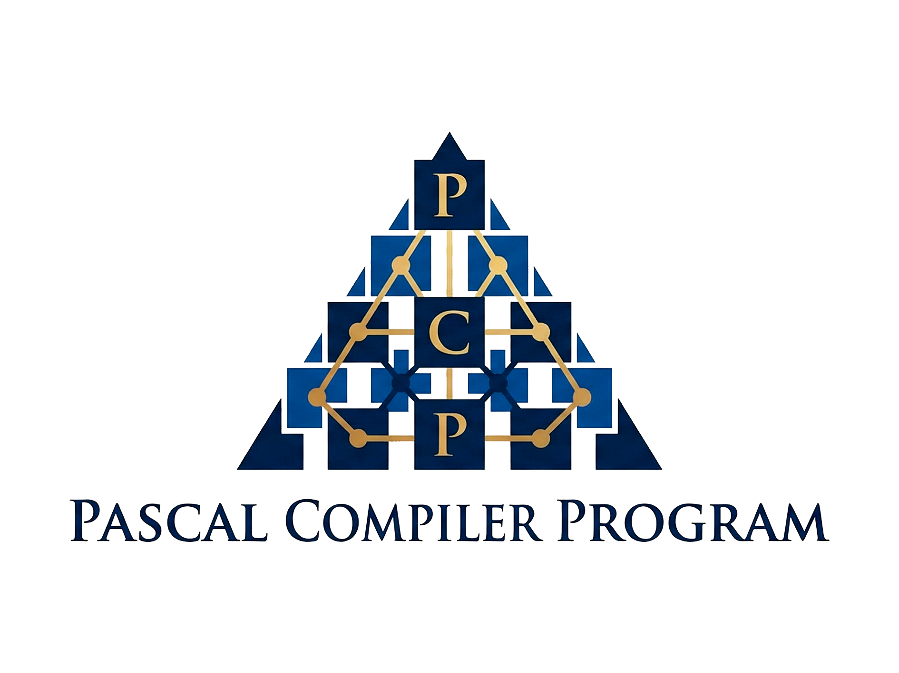

# **Pascal Compiler Program**



## **Introdução**

No âmbito da unidade curricular de Processamento de Linguagens e Compiladores, desenvolvemos um compilador em Python, o Pascal Compiler Program, para um subconjunto da linguagem Pascal baseado no ISO 7185, com algumas extensões comuns (como o tipo `string` nativo). O compilador traduz programas Pascal para código executável numa [máquina virtual de pilha](https://ewvm.epl.di.uminho.pt).

### Funcionalidades Suportadas

O compilador desenvolvido suporta as seguintes funcionalidades da linguagem Pascal:

- **Tipos de dados**: `integer`, `real`, `boolean`, `char`, `string`
- **Tipos compostos**: arrays (incluindo multidimensionais) e records
- **Estruturas de controlo**: `if-then-else`, `while`, `for`, `repeat-until`, `case`, `goto`
- **Subprogramas**: funções e procedimentos com parâmetros
- **Operadores**: aritméticos (`+`, `-`, `*`, `/`, `div`, `mod`), relacionais (`=`, `<>`, `<`, `>`, `<=`, `>=`) e lógicos (`and`, `or`, `not`)
- **I/O**: `read`, `readln`, `write`, `writeln`

### Exemplo de Compilação

O seguinte programa Pascal:

```pascal
program HelloWorld;
begin
    writeln('Ola, Mundo!');
end.
```

É traduzido para o seguinte código da máquina virtual:

```
jump main
main:
start
pushs "Ola, Mundo!"
writes
writeln
stop
```

### Estrutura do Projeto

O compilador está organizado nos seguintes módulos:


| Ficheiro     | Descrição                                                        |
| ------------ | ---------------------------------------------------------------- |
| `analex.py`  | Analisador léxico (tokenização)                                  |
| `anasin.py`  | Analisador sintático (parsing e construção da AST)               |
| `anasem.py`  | Analisador semântico (verificação de tipos e tabela de símbolos) |
| `geraCod.py` | Gerador de código para a máquina virtual                         |
| `Erros.py`   | Gestão centralizada de mensagens de erro                         |

## **Análise Léxica**

O analisador léxico foi implementado no ficheiro `analex.py` utilizando a biblioteca PLY (Python Lex-Yacc). Esta fase é responsável por converter o código-fonte Pascal numa sequência de tokens.

### Tokens Reconhecidos

O lexer reconhece 55 tipos de tokens, organizados nas seguintes categorias:

**Palavras reservadas** (35 tokens): `program`, `begin`, `end`, `var`, `const`, `type`, `function`, `procedure`, `if`, `then`, `else`, `while`, `for`, `do`, `to`, `downto`, `repeat`, `until`, `case`, `of`, `goto`, `label`, `array`, `record`, `and`, `or`, `not`, `div`, `mod`, `in`, `nil`, entre outras.

**Tipos de dados**: `integer` (inclui variantes `smallint`, `longint`, `byte`), `real`, `boolean`, `char`.

**Valores literais**:

- `INTVALUE`: números inteiros (`\d+`)
- `REALVALUE`: números reais (`\d+\.\d+`)
- `BOOLVALUE`: `true` ou `false`
- `STRINGVALUE`: strings delimitadas por `'`
- `CHARVALUE`: caracteres únicos (`'x'`)

**Operadores compostos**: `:=` (atribuição), `<=`, `>=`, `<>`, `..` (sub-intervalo)

### Exemplo de Tokenização

O seguinte código Pascal:

```pascal
var x: integer;
x := 10;
```

Produz a sequência de tokens:

```
VAR, VARNAME('x'), ':', INTEGER, ';', VARNAME('x'), ATR, INTVALUE(10), ';'
```

### Decisões de Implementação

**Case-insensitivity**: O Pascal é insensível a maiúsculas/minúsculas. Implementámos isto convertendo todos os identificadores para minúsculas antes da comparação com palavras reservadas:

```python
def t_KEYWORDS(t):
    r'[A-Za-z_][A-Za-z0-9_]*'
    val = t.value.lower()
    reserved = {'begin': 'BEGIN', 'end': 'END', ...}
    if val in reserved:
        t.type = reserved[val]
    else:
        t.type = 'VARNAME'
    return t
```

Isto permite que código como o seguinte seja aceite:

```pascal
proGRAm TesteCaotico;
VAR Valor: iNteGeR;
bEgin
   wRitEln('Teste');
enD.
```

**Estado especial `ended`**: Após reconhecer `end.`, o lexer transita para um estado que ignora qualquer conteúdo adicional, emitindo apenas um aviso. Isto evita erros por texto acidental após o fim do programa.

**Tratamento de comentários**: São suportados três estilos:

- `// comentário de linha`
- `{ comentário de bloco }`
- `(* comentário alternativo *)`

### Deteção de Erros

Caracteres inválidos geram exceções com localização precisa:

```
ERRO LÉXICO: Carácter ilegal '@' não reconhecido. [Linha 5, Coluna 12]
```

# **Análise Sintática**

O analisador sintático foi implementado no ficheiro `anasin.py` utilizando o módulo `ply.yacc`. Esta fase verifica se a sequência de tokens obedece à gramática da linguagem Pascal e constrói uma representação estruturada do programa (AST).

### Gramática Implementada

A gramática do compilador segue a estrutura típica de um programa Pascal. Apresentamos aqui as produções principais:

```
programa     → PROGRAM VARNAME ';' bloco_declaracoes bloco_main
bloco_decl   → decl_labels | decl_consts | decl_types | decl_vars | decl_rotinas
decl_vars    → VAR lista_decl_vars
instrucao    → atribuicao | chamada_rotina | if | while | for | repeat | case | goto
expressao    → termo (('+' | '-' | OR) termo)*
termo        → fator (('*' | '/' | DIV | MOD | AND) fator)*
fator        → literal | variavel | '(' expressao ')' | NOT fator | chamada_funcao
```

### Estrutura da AST

O parser produz uma AST representada como dicionários Python. Por exemplo, o programa:

```pascal
program Teste;
var x: integer;
begin
    x := 5;
end.
```

Gera a seguinte estrutura:

```python
{
    'nome': 'teste',
    'decl': [{'tipo': 'DECL_VARS', 'vals': [{'nome': 'x', 'tipo': 'integer'}]}],
    'main': [{'tipo': 'ATRIB', 'var': 'x', 'val': {'tipo': 'LITERAL', 'valor': 5}}]
}
```

### Declarações Suportadas

O analisador reconhece todas as formas de declaração do Pascal:

| Declaração    | Exemplo                                  |
| ------------- | ---------------------------------------- |
| Labels        | `label 100, 200;`                        |
| Constantes    | `const PI = 3.14159;`                    |
| Tipos         | `type Vetor = array[1..10] of integer;`  |
| Variáveis     | `var x, y: integer;`                     |
| Funções       | `function soma(a, b: integer): integer;` |
| Procedimentos | `procedure escrever(msg: string);`       |

### Instruções Suportadas

O compilador suporta as seguintes instruções, cada uma com a sua produção gramatical:

**Atribuição**: `variavel := expressao`

```pascal
x := 10;
arr[i] := arr[i] + 1;
pessoa.nome := 'João';
```

**Condicionais**:

```pascal
if x > 0 then
    writeln('positivo')
else
    writeln('não positivo');
```

**Ciclos**:

```pascal
while i < 10 do i := i + 1;

for i := 1 to 10 do writeln(i);

repeat
    x := x - 1;
until x = 0;
```

**Case**:

```pascal
case opcao of
    1: writeln('Um');
    2: writeln('Dois');
end;
```

### Precedência de Operadores

Definimos a precedência dos operadores para garantir a avaliação correta das expressões:

| Precedência | Operadores                      |
| ----------- | ------------------------------- |
| Mais baixa  | `or`                            |
|             | `and`                           |
|             | `=`, `<>`, `<`, `>`, `<=`, `>=` |
|             | `+`, `-`                        |
| Mais alta   | `*`, `/`, `div`, `mod`          |

### Tratamento de Erros

O parser gera mensagens de erro contextualizadas, exemplo de erro:

```
Erro Sintático: Token inesperado 'begin' (tipo: BEGIN). Verifique se falta ';' antes do 'BEGIN'. (Linha 7)
```

# **Análise Semântica**

O analisador semântico foi implementado no ficheiro `anasem.py` através da classe `AnalisadorSemantico`. Esta fase valida as regras de contexto da linguagem e decora a AST com informações necessárias à geração de código.

### Tabela de Símbolos

A estrutura central é a `tabela_simbolos`, um dicionário que mapeia identificadores para os seus metadados:

```python
tabela_simbolos = {
   '999': {'tipo': 'label'},  # Labels
   'pi': {'categoria': 'const', 'datatype': 'real', 'valor': 3.14159},  # Constantes
   'idade': {  # Tipos definidos pelo utilizador
       'categoria': 'type',
       'tipo': 'subrange',
       'min': 0, 'max': 120,
       'datatype': 'integer',
       'size': 1
   },
   'x': {  # Variáveis simples
       'categoria': 'var',
       'tipo': {'tipo': 'atomico', 'nome': 'integer', 'size': 1},
       'sp': 0
   },
   'arr': {  # Arrays
       'categoria': 'var',
       'tipo': {'tipo': 'array', 'dimensoes': [{'min': 1, 'max': 10}], 'of': {...}, 'size': 10},
       'sp': 1
   },
   'soma': {  # Funções
       'categoria': 'func',
       'args': [{'nome': 'a', 'tipo': {...}, 'sp': -1}, ...],
       'vars': {...},  # Variáveis locais
       'return': {'tipo': 'atomico', 'nome': 'integer', 'size': 1}
   }
}
```

### Gestão de Tipos Complexos

O método `_processar_tipo` calcula recursivamente o tamanho e estrutura de memória de tipos compostos:

- **Arrays Multidimensionais**: tamanho = produto das dimensões
- **Records**: calcula o offset de cada campo relativo ao início da estrutura

### Alocação de Memória

Cada variável recebe um atributo `sp` (Stack Pointer):

| Contexto             | Endereçamento                                  |
| -------------------- | ---------------------------------------------- |
| Variáveis globais    | Endereços sequenciais positivos (0, 1, 2, ...) |
| Parâmetros de função | Offsets negativos relativos ao frame pointer   |
| Variáveis locais     | Offsets positivos após os parâmetros           |

### Controlo de Escopo

O analisador implementa escopo hierárquico. Durante a análise de uma função, é criada uma tabela de símbolos local. A resolução de variáveis verifica primeiro o escopo local, depois o global, permitindo **shadowing** de variáveis.

### Verificação de Tipos

O sistema de tipos é estático e forte, com conversão automática (coerção) implícita controlada:

| Verificação              | Exemplo                                       |
| ------------------------ | --------------------------------------------- |
| Compatibilidade numérica | `integer + real` → `real`                     |
| Condições booleanas      | `if x > 0 then` (condição deve ser `boolean`) |
| Chamadas de funções      | Número e tipo de argumentos corretos          |

### Exemplo de Erro Semântico

```pascal
var x: integer;
begin
    x := 'texto';  { Erro: tipos incompatíveis }
end.
```

Gera:

```
ERRO SEMÂNTICO: Não é possível atribuir 'string' a variável do tipo 'integer'. [Linha 4]
```

O tratamento de erros utiliza acumulação (classe `Erros`), permitindo detetar múltiplos erros numa única execução.

# **Geração de Código**

O gerador de código foi implementado no ficheiro `geraCod.py` através da classe `GeraCod`. Esta fase traduz a AST validada para código executável na máquina virtual de pilha.

### Máquina Virtual Alvo

O código gerado destina-se a uma máquina virtual de pilha com as seguintes instruções:

| Categoria  | Instruções                                                             |
| ---------- | ---------------------------------------------------------------------- |
| Pilha      | `pushi`, `pushf`, `pushs`, `pushg`, `pushl`, `pushgp`, `pushfp`, `pop` |
| Aritmética | `add`, `sub`, `mul`, `div`, `mod`, `fadd`, `fsub`, `fmul`, `fdiv`      |
| Comparação | `equal`, `inf`, `sup`, `infeq`, `supeq`, `fequal`, `finf`, `fsup`      |
| Lógica     | `not`, `and`, `or`                                                     |
| Controlo   | `jump`, `jz`, `call`, `return`                                         |
| Memória    | `load`, `store`, `loadn`, `storen`, `padd`                             |
| I/O        | `read`, `writei`, `writef`, `writes`, `writeln`                        |

### Estrutura do Código Gerado

O método `gera_codigo` produz a seguinte estrutura:

```
                   ; (alocação de variáveis globais - ANTES de tudo)
jump main          ; Salta para o programa principal
                   ; (definições de funções aqui)
main:
start              ; Início do programa
                   ; (instruções do bloco principal)
stop               ; Fim do programa
```

A alocação de variáveis globais é feita **antes** do `jump main`, através do método `_abreEspacio`, que percorre a tabela de símbolos e emite instruções de inicialização (`pushi 0`, `pushf 0`, `pushn n`) para cada variável.

### Exemplo Completo de Compilação

**Código Pascal:**

```pascal
program Soma;
var a, b, resultado: integer;
begin
    a := 5;
    b := 3;
    resultado := a + b;
    writeln('Resultado: ', resultado);
end.
```

**Código Gerado:**

```
pushi 0            ; aloca 'a' (sp=0)co
pushi 0            ; aloca 'b' (sp=1)
pushi 0            ; aloca 'resultado' (sp=2)
jump main
main:
start
pushi 5
storeg 0           ; a := 5
pushi 3
storeg 1           ; b := 3
pushg 0            ; carrega 'a'
pushg 1            ; carrega 'b'
add                ; a + b
storeg 2           ; resultado := ...
pushs "Resultado: "
writes
pushg 2
writei
writeln
stop
```

### Tratamento de Expressões

A avaliação de expressões usa notação pós-fixada. O método `gera_expressao` empilha operandos antes de aplicar operadores:

```pascal
x := (a + b) * c;
```

Gera:

```
pushg 0            ; empilha 'a'
pushg 1            ; empilha 'b'
add                ; a + b
pushg 2            ; empilha 'c'
mul                ; (a + b) * c
storeg 3           ; guarda em 'x'
```

### Coerção de Tipos

Operações mistas `integer`/`real` são tratadas automaticamente:

```python
if t_left == 'integer' and t_right == 'real':
    self.emit("swap")
    self.emit("itof")    # converte integer para float
    self.emit("swap")
```

### Estruturas de Controlo

**IF-THEN-ELSE:**

```pascal
if x > 0 then
    writeln('positivo')
else
    writeln('negativo');
```

Gera:

```
pushg 0            ; x
pushi 0            ; 0
sup                ; x > 0
jz ELSE1           ; salta se falso
pushs "positivo"
writes
writeln
jump ENDIF1
ELSE1:
pushs "negativo"
writes
writeln
ENDIF1:
```

**FOR:**

```pascal
for i := 1 to 10 do
    writeln(i);
```

Gera etiquetas únicas (`L1`, `L2`, ...) e instruções de incremento/comparação.

### Funções e Procedimentos

Para sub-rotinas, o gerador:

1. Emite a definição com label (`funcao_nome:`)
2. Reserva espaço para variáveis locais (`pushn n`)
3. Gera código do corpo
4. Emite `return` com limpeza de pilha

**Chamada:**

```
; empilha argumentos
pusha funcao_nome
call
pop n              ; limpa argumentos da pilha
```

### Acesso a Arrays e Records

Para tipos compostos, calcula-se o endereço com aritmética de ponteiros:

```pascal
arr[i] := 10;      { arr é array[1..10] of integer }
```

Gera:

```
pushgp             ; base pointer
pushi 0            ; offset base do array
padd               ; endereço base
pushg ...          ; valor de 'i'
pushi 1            ; subtrai limite inferior
sub
padd               ; endereço final
pushi 10
storen             ; guarda valor
```

# **Conclusão**

## Funcionalidades Implementadas

O compilador desenvolvido suporta um subconjunto significativo da linguagem Pascal Standard:

✅ Tipos básicos: `integer`, `real`, `boolean`, `char`, `string`  
✅ Tipos compostos: arrays (incluindo multidimensionais) e records  
✅ Declarações: constantes, tipos, variáveis, funções e procedimentos  
✅ Estruturas de controlo: `if`, `while`, `for`, `repeat`, `case`, `goto`  
✅ Operadores aritméticos, relacionais e lógicos  
✅ Coerção implícita integer/real  
✅ Escopo hierárquico (global/local)  
✅ I/O: `read`, `readln`, `write`, `writeln`

## Testes Realizados

Foram desenvolvidos 13 programas de teste cobrindo diferentes funcionalidades:

| Teste        | Funcionalidade                     |
| ------------ | ---------------------------------- |
| `teste1.pp`  | Hello World básico                 |
| `teste5.pp`  | Função (conversão binário→inteiro) |
| `teste8.pp`  | Case-insensitivity                 |
| `teste11.pp` | Arrays e ciclos                    |
| `teste12.pp` | Records                            |

## Reflexão Final

A realização deste projeto permitiu compreender na prática o funcionamento de um compilador. As principais aprendizagens foram:

1. A importância de uma **gramática bem definida** para evitar ambiguidades
2. A interligação entre as fases — a precisão na análise sintática facilita a construção da AST e a geração de código
3. A utilidade de ferramentas como **PLY** para prototipagem rápida de compiladores
4. A complexidade da gestão de **escopo e tipos** em linguagens reais

O compilador funciona corretamente para os programas testados, demonstrando a aplicação prática dos conceitos de Processamento de Linguagens e Compiladores.
